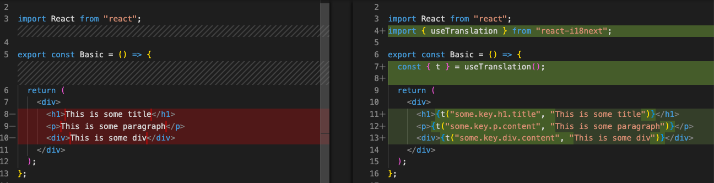

+++
title = "Scaffolding your internationalization in React with automation"
description = "Bootstrapping your internationalization by automatically transforming your code"
date = 2024-12-26
tags = ["i18n", "react", "react-intl", "react-i18next", "ts-morph", "automation"]
summary = "In this introduction into the topic of automating your internationalization codebase we cover how to replace hard coded strings with translation functions. We use ts-morph to parse, navigate and manipulate the AST and the examples should provide a general idea on how to get started with your own i18n transformations."
+++

## Introduction

**Internationalization is often an afterthought** when starting to build an application, where the focus is often on a single market with a single language. At some point in time internationalization becomes a topic, especially when the application needs to expand into new markets or regions. That is when the existing codebase needs to be adapted to handle multiple languages, which not only includes translating strings but can also include currency, pluralization or time handling.

Depending on the maturity and size of the codebase, this can mean **updating and refactoring thousands of files** and needing to introduce hundreds or thousands of translations keys.
There are a number of popular **i18n libraries** in **React**, capable of handling most internationalization requirements and offer React specific implementations like **context, hooks or higher order components**. Examples for these libraries are **[react-intl](https://formatjs.github.io/docs/react-intl/)**, **[react-i18next](https://react.i18next.com/)** or **[lingui](https://lingui.dev/)**.

The task of **finding and replacing hard coded strings with a translation function**, i.e. a hook, can be a time-consuming task, where you also might miss some translatable content or introduce other bugs like breaking the pluralization of a sentence. It's also not only about finding static strings, it's also about localizing currencies, digits or time occurrences in the code.

To speed up the process of introducing i18n into an existing codebase we can try to **automate parts of the process**. In the following sections we will try to automate replacing hard coded strings with a translate function for react-i18next and react-intl codebases.

## Replacing hard coded strings with translate functions

To get a better understanding, let's start with a very basic example:

```tsx
import React from "react";

export const Basic = () => {
  return (
    <div>
      <h1>This is some title</h1>
      <p>This is some paragraph</p>
      <div>This is some div</div>
    </div>
  );
};
```

We can identify three possible translation keys that can be introduced in the above component. The content inside the `h1` tag would be wrapped within a `t` function (or an equivalent translation function):

```tsx
<h1>{t("some.key.h1.title", "This is some title")}</h1>
```

Inside the `t` function a key and a default translation, which is optional, would be defined. The same `t` function can be applied inside the p and div tags in that example.

If we assume we are using react-i18next, we would want a script that automatically finds all hard coded strings inside a React component and then wraps these found strings with a `t` function. Additionally the script should create keys based on some rules and import the hook (if the hook is not imported in the affected file). It should also initialize the `t` function inside the component.
So there are a couple of things that need to be done:

1. Import `useTranslation` hook, if it is not imported in the file

2. Call the hook inside the component: `const {t} = useTranslation()`

3. Replace all hard coded strings with a `t` function that creates a key and uses the string as the default translation `{t("some.specific.key", "This is some title")}`

The expected result of a transformation based on the previous example would be:

```tsx
import React from "react";
import { useTranslation } from "react-i18next";

export const Basic = () => {
  const { t } = useTranslation();

  return (
    <div>
      <h1>{t("some.key.h1.title", "This is some title")}</h1>
      <p>{t("some.key.p.content", "This is some paragraph")}</p>
      <div>{t("some.key.div.content", "This is some div")}</div>
    </div>
  );
};
```

The full diff showing the required changes, that we want to automate:



## Setting up ts-morph

Before we write the actual React specific script, we will need a way to **parse, navigate and manipulate the AST**. **TypeScript** has a [compiler API](https://github.com/microsoft/TypeScript/wiki/Using-the-Compiler-API), which enables to transform JavaScript/TypeScript.
**[ts-morph](https://ts-morph.com/)** is a wrapper around the original Typescript compiler API to simplify interacting and working with that compiler.
Run the following command to install `ts-morph`:

```bash
// npm
npm install --save-dev ts-morph

// pnpm
pnpm add --save-dev ts-morph

// yarn
yarn add --dev ts-morph
```

Once ts-morph is installed, we can start implementing the automation code to transform any hard coded strings inside a JSX component to translate functions containing a generated key and the replaced hard coded string as the default value.

The transformation we want to write should work for **React function components** as we want to use the `useTranslation` or the `useIntl` hook. So in the first iteration we will only focus on these functions. In further iterations the transformation could also check for alt tags and other possible translatable content.

We can define a `transform` to enable the interaction:

```tsx
import { Project, ProjectOptions, SyntaxKind, ts } from "ts-morph";

export const transform = ({
  tsConfigFilePath,
  filesPaths,
}: {
  tsConfigFilePath?: ProjectOptions["tsConfigFilePath"];
  filesPaths: string | string[];
}) => {
  const project = new Project({
    tsConfigFilePath,
  });

  project.addSourceFilesAtPaths(filesPaths);
};
```

To help with exploring the AST of the source code, we want to transform, we can use the [TypeScript AST Viewer](https://ts-ast-viewer.com/).

## Implementing a transformation script for react-i18next

We can get hold of all the provided source files by calling `getSourceFiles` and then iterate over these files. For every file we want to check if the statements include nodes of type `JsxText`. If we don't have any translatable content for a statement, we want to skip and test the next statement.

```ts
for (const sourceFile of project.getSourceFiles()) {
  for (const statement of sourceFile.getStatements()) {
    const hasTranslatableContent = statement
      .getDescendantsOfKind(SyntaxKind.JsxText)
      .some((node) => !node.containsOnlyTriviaWhiteSpaces());

    if (!hasTranslatableContent) {
      continue;
    }

    // replace the any string with the translation
  }
}
```

Once we know a statement has any translatable strings, we use the `transform` method to manipulate any nodes of type `JsxText` and have translatable content. The `transform` also provides `traversal` with which we can use to call the `updateJsxText` and update the translatable node.
In our case we are only doing a naive key generation based on the file name and the text content. This key generation can be more complex and should be defined and implemented based on your assumptions.

```ts
statement.transform((traversal) => {
  const node = traversal.visitChildren();
  if (ts.isJsxText(node) && !node.containsOnlyTriviaWhiteSpaces) {
    const text = node.getText();
    const key = `${sourceFile
      .getBaseNameWithoutExtension()
      .toLowerCase()}.${text
      .substring(0, 100)
      .replace(/ /g, "_")
      .toLowerCase()}`;

    return traversal.factory.updateJsxText(node, `{t("${key}", "${text}")}`);
  }
  return node;
});
```

The next step is to check if we have a named import for the `useTranslation` hook and if not add it to the imports. Our check is more simple and assumes that only if we have no `react-i18next` import declaration, the `useTranslation` should be added. As a further improvement we could also check if there is an import for the library but no named import of `useTranslation`.

```ts
// add import function
const hasUserTranslationImport =
  sourceFile.getImportDeclaration("react-i18next");

if (!hasUserTranslationImport) {
  sourceFile.addImportDeclaration({
    namedImports: ["useTranslation"],
    moduleSpecifier: "react-i18next",
  });
}
```

Once we have updated all the strings and replaced them with the `t` function, we also need to check if there is already a `t` function available in the component. By going through all the available `CallExpression` nodes and checking if any of the expressions starts with `useTranslation`.

```ts
// add useTranslation hook
const hasTranslateHook = statement
  .getDescendantsOfKind(ts.SyntaxKind.CallExpression)
  .some((node) => node.getText().startsWith("useTranslation"));
```

If we don't have an existing translation hook, we can create the hook and set it at the very beginning of the component.

```ts
if (!hasTranslateHook) {
  // add the useTranslation hook as no translation was found
  const [blocks] = statement.getDescendantsOfKind(SyntaxKind.Block);
  const useTranslationStatement = printNode(
    factory.createVariableStatement(
      undefined,
      factory.createVariableDeclarationList(
        [
          factory.createVariableDeclaration(
            factory.createObjectBindingPattern([
              factory.createBindingElement(
                undefined,
                undefined,
                factory.createIdentifier("t"),
                undefined,
              ),
            ]),
            undefined,
            undefined,
            factory.createCallExpression(
              factory.createIdentifier("useTranslation"),
              undefined,
              [],
            ),
          ),
        ],
        ts.NodeFlags.Const,
      ),
    ),
  );

  if (blocks) {
    blocks.insertText(blocks.getStatements()[0].getPos(), (writer) => {
      writer.newLine();
      writer.write(useTranslationStatement);
      writer.newLine();
    });
  }
}
```

Finally we need to format and save the file.

```ts
sourceFile.formatText();
sourceFile.saveSync();
```

With those changes we can now pass any files to the `transform` function and it will try to automatically replace any hard coded string in the JSX code with a translate function containing a generated key and the replaced string as the default value. You can check the complete implementation [here](https://github.com/lingualdev/react-i18n-transformations/blob/main/src/transformers/react-i18next.ts)

## Implementing a transformation script for react-intl

The code for transforming a react-intl codebase is very similar to the previous code for the react-i18next implementation. The main differences here are the import statement which needs to import the `useIntl` hook from the `react-intl` library and the hard coded string should be transformed to the following function call: `intl.formatMessage({id: 'some.key', defaultMessage: 'This is the default text'})`.

The transforming of the found statements is identical to the previous implementation, the only difference here is that we are returning the `intl.formatMessage` function call and passing an object containing the `id`, which is the key we generate and the `defaultMessage`, which is the string we are replacing.

```ts
statement.transform((traversal) => {
  const node = traversal.visitChildren();
  if (ts.isJsxText(node) && !node.containsOnlyTriviaWhiteSpaces) {
    const text = node.getText();
    const key = `${sourceFile
      .getBaseNameWithoutExtension()
      .toLowerCase()}.${text
      .substring(0, 100)
      .replace(/ /g, "_")
      .toLowerCase()}`;

    return traversal.factory.updateJsxText(
      node,
      `{intl.formatMessage({id: "${key}", defaultMessage: "${text}"})}`,
    );
  }
  return node;
});
```

The inserting of the import function is also identical to the react-i18next implementation and only replaces the named import and the module name:

```ts
// add import function
const hasUserTranslationImport = sourceFile.getImportDeclaration("react-intl");

if (!hasUserTranslationImport) {
  sourceFile.addImportDeclaration({
    namedImports: ["useIntl"],
    moduleSpecifier: "react-intl",
  });
}
```

The check if a translation hook is already defined inside the component only requires to check if any call expression starts with `useIntl`.

```ts
// add useTranslation hook
const hasTranslateHook = statement
  .getDescendantsOfKind(ts.SyntaxKind.CallExpression)
  .some((node) => node.getText().startsWith("useIntl"));
```

As we can see, the code is very similar and could be further refactored to support both cases if needed. You can check the complete react-intl implementation [here](https://github.com/lingualdev/react-i18n-transformations/blob/main/src/transformers/react-intl.ts).

## Summary

In this introduction into the topic of **automating your internationalization codebase** we covered how to replace hard coded strings with translation functions. We used ts-morph to parse, navigate and manipulate the AST and the examples should provide a general idea on how to start with i18n transformations.
We recommend to try out the [Github example repository](https://github.com/lingualdev/react-i18n-transformations) and see the implementation details.

Based on these basic implementations, you can create a CLI command that accepts the path - which can be a single file, folder or a glob pattern - and then apply these changes for the given path.

We are also planning to add transformations in [`i18n-check`](https://github.com/lingualdev/i18n-check) to help with scaffolding your internationalization efforts for your react-i18next and react-intl codebases.

If you have questions or more ideas on how to extend the i18n transformations send us a message on [Bluesky](https://bsky.app/profile/lingualdev.bsky.social) or open an issue directly in the [Github repository](https://github.com/lingualdev/react-i18n-transformations).

### Links

[Github repository](https://github.com/lingualdev/react-i18n-transformations)

[ts-morph](https://ts-morph.com/)

[react-i18next](https://react.i18next.com/)

[react-intl](https://formatjs.github.io/docs/react-intl/)

[i18n-check](https://github.com/lingualdev/i18n-check)
