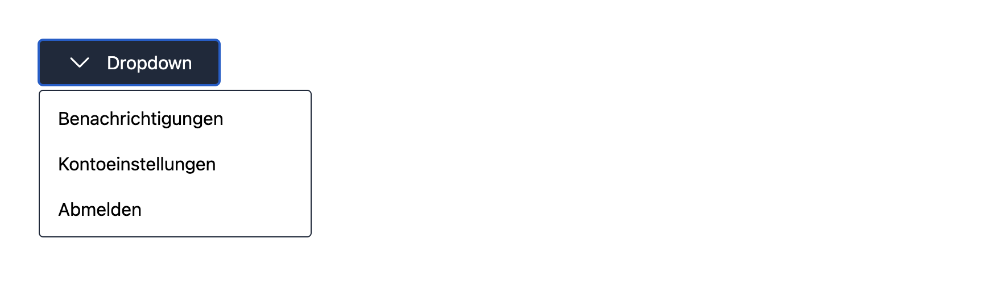

+++
title = "Building international User Interfaces"
date = 2024-09-08
slug = "building-international-user-interfaces"
tags = ["i18n","UX","Design"]
summary = "Designing user interfaces that can adapt to internationalization requirements by considering how the user interface can break and ways to prevent it."
+++

## Introduction

At some point your application might expand to new territories where you will need to support new languages and consider regional differences. The initial designs were probably **created with one language in mind**, let's say for example the width or height of a user interface element were optimized for that default language. But what happens when we need to support more languages?

Depending on the region, we might run into some issues that we didn't consider when initially designing the user interface or screen. So while the sentence fits nicely in the existing UI element, we might now be dealing with a very long sentence in a different language. This might **break our UI element**, giving the impression that we are dealing with a broken application. More than suboptimal.

But aside from broken UI elements, we might see more issues arise. In this post we will go through a couple of scenarios that might come with introducing **i18n/l10n** and see how we can think about **internationalization** and **localization** when designing our user interfaces independent of supporting one or more languages.

## Making the UI adaptable to locale changes

The first step when building a user interface might happen inside some design software and not code. This is already a good moment to **think how different sentence lengths and directions might work** when designing the element.
Think about languages like Chinese or Arabic and then think about how the element would behave when the text direction or the number of characters drastically changes. We want to design our elements, components and layouts to be flexible and adapt to the region without having to change or rewrite our code.

## Consider varying translation lengths

Take for example the word `welcome` in English, this translates to `willkommen` in German or `mile widziany` in Polish. We notice varying lengths between the different languages. Things become even more apparent when we deal with full sentences.

What happens when we use a button with a specified action like `Cancel`? In German that would translate to `Abbrechen`, the latter translation being 1.5 times the length of the English word. We need to account for the fact that our text might be wider than the originally defined button width.
The button might appear broken and we want to avoid that. Let's take a look at a more specific example: you have a button that contains the text
`Update settings`, which is 15 characters. The original design of that button considers the length for `Update settings` and the style definitions revolve around that text. This works till you need to support a new language.
The equivalent German version of that button would be `Einstellungen aktualisieren`, which is 27 characters long.
So, we can see that the character length between just these two languages varies, with the German translation containing almost twice the number of
characters. Not considering the varying text length
can cause the text to overflow.


From the above example we can see that we need to **make the user elements responsive**, so that the text always fits into the button without breaking the design.


This can be quite challenging when starting out with a design, so it might be best to play around with different sentences that vary in length.
By following that approach, we can consider scenarios where the sentence might be 200% or more longer compared to the default translation.
**Consider elements like navigation, menu, dropdown or toggle to break when the text length changes**.
If we think this a little further, a text overflow can be more than just a visual defect - the text overflow might even overlap an action, like another button, making that button non functional.


_Overflowing text can break other UI elements_

Here is another example of how a dropdown can break:


By making our dropdown responsive we can adapt to the word length:



## Use an i18n library from the start

A good approach is to incorporate a **translation library** into the codebase from the start, no matter if the application currently supports one or more languages. So even if the application only supports one language at the very beginning, it will already have **translation functions** in place that **replace the hardcoded default language text**. Not only does it already force us to think about how things like currencies, digits and pluralization will work, we can already use features provided by the translation library. Think for example about **pluralization**, we don't have to write the code that checks for the number of items and then adapts the word. We can directly use the pluralization capability provided by an i18n library.

There are a couple of benefits that come from this approach:

1. We can randomize the strings for testing purposes and see how the layout or elements look and behave when we change the length of the text content.

2. It enables to preview the UI with a possible future language, by adding translation files for that language.

3. Decouples the localization from the code, which enables non developers to add or update a specific locale without the help of the development team.

## Do not rely on the ordering of words

To make the user interface responsive we also need to consider our assumptions about how words are ordered in the default language as opposed to how they are ordered in the target language.

We should make as little assumptions as possible and best casde is to completely **avoid relying on the word oder from a code level** perspective. Hardcoding assumptions about the ordering can make some languages display broken translations or even make them non translatable. In the following we will look at a couple of examples and find out what we can do to avoid those exact scenarios.

One scenario is embedding different user elements in between a sentence:


We notice that we are relying on a hardcoded ordering: _text_, _select element_ and _text_. This becomes complicated to translate. Not only are we relying on the element to be at the correct position, we also need to provide information in regards to what the element is doing, so the translator has some context.

In the above example it is better to **separate the text from the user interface element**. By taking this approach, it becomes easier for the translator to form a valid sentence without having to consider the select element position within that sentence.


A more subtle example of relying on the word ordering could be the following sentence:


If the sentence is constructed of three different parts (text, link, text) and then concatenated together, we will need to remove the reliance of the word ordering to solve the issue.

```txt
t("You can find more information") +
t("<a href="#">here</a>") +
t("or in  the faq section.")
```

Instead of splitting up the sentence into three different parts, an alternative is to use **interpolation** instead.

```txt
t("You can find more information <a href="{href}">here</a> or in  the faq section.")
```

Turning the three parts into a single sentence with a placeholder value for the link, enables to correctly translate the full sentence (including the link) in the target language.

Avoiding having to rely on the word ordering enables more flexible options when translating to a different target lanuage. Again, the tip to **use an i18n library** applies here as well. Depending on the libarary we can use features like pluralization or HTML interpolation, which can help to avoid breaking assumptions about plurals, gender or HTML tags.

## Summary

We can take away some learnings when designing international user interfaces, elements and components. It's not that simple as it seems at first. Relying on the default language when designing UI elements can lead to issues once we need to support more languages. A good approach is to start adding an i18n library from the start. This helps to think about how sentences should be constructed, how the text lenght and ordering of words can change depending on the language and how this effects the user interface.

If you have any questions or want to leave some feedback, you can find us on [Twitter](https://twitter.com/lingualdev).
