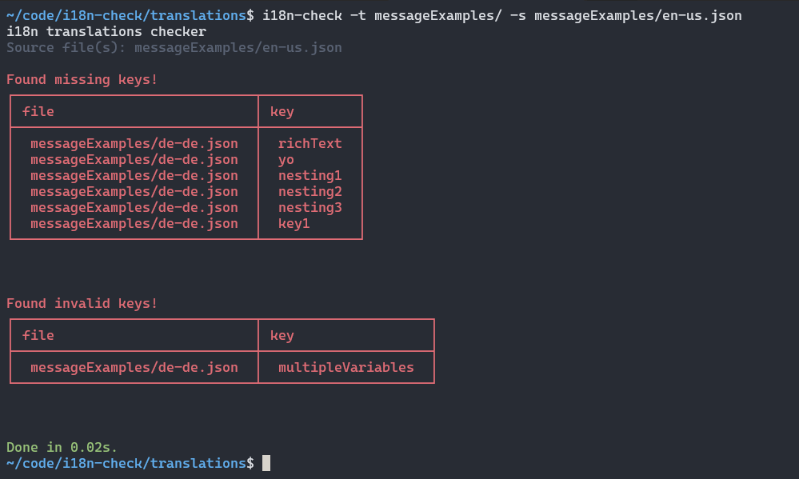

+++
title = "Checking your i18n on the CI"
date = 2024-09-13
tags = ["i18n", "CI", "DX"]
slug = "checking-your-i18n-on-the-ci"
summary = "An introduction into how to run i18n validation checks on the CI to ensure your translation are in sync."
+++

## Introduction

It is always a good idea to run some checks against your codebase when opening up a pull-request or when merging a branch. We run different tests, builds and other **checks before or after a merge**. But how often have you ran any checks to validate if your translation files are in sync and in a valid state?

Using continuous integration to validate **i18n specific files** is useful. We want to run some validations and checks in regards to **i18n**, which most probably will include some JSON, YAML files or other formats,
containing the locale specific translations. We will talk about the possible checks we might want to run and how they can fit into your existing workflow in this write-up.

## What we want to validate

One way to run checks against an existing branch or after a merge is to **run an action that should validate that all locale files are in sync**. That action should also check if any **translations are broken** and try to detect if any **keys are unused** in the codebase, but exist in the default locale file.

The result of running the action should provide us with enough information about the **current status of the validated translations**. Typically translations can be out of sync without anyone noticing, especially if the translations are not handled by developers but by translators or managers, that are detached from the actual code.

We can use the **Lingual** [`i18n-check`](https://github.com/lingualdev/i18n-check) a tool for checking your translations, which can be run the `CLI` as well as on the `CI`. `i18n-check` can help with validating translation files, checking for missing and/or invalid/broken translations. By comparing the defined source language with all target translation files it will try to detect all **inconsistencies between source and target files**. Next we will install `i18n-check` and setup a **Github action** that will run checks every time we open a pull request.

## Setting up the Github Action

First thing we need to do is install `i18n-check`:

```bash
yarn add --dev @lingual/i18n-check
```

Via npm:

```bash
npm install --save-dev @lingual/i18n-check
```

Via pnpm:

```bash
pnpm add --save-dev @lingual/i18n-check
```

The next step is to update the `package.json` file and add a new command:

```json
"scripts": {
// ...other commands,
"i18n-check": "i18n-check"
}
```

Once the script is updated, the `i18n-check` can be run via the command-line, i.e. via `yarn i18n-check`.

Now that we have `i18n-check` installed and the command set up, we can write a **workflow** definition using a **YAML** file:

```yaml
name: i18n Check
on:
  pull_request:
    branches:
      - main
  push:
    branches:
      - main

jobs:
  i18n-check:
    runs-on: ubuntu-latest

    steps:
      - uses: actions/checkout@master

      - name: yarn install & build
        run: |
          yarn install
          yarn build

      - name: yarn i18n-check
        run: |
          yarn i18n-check -t translations/messageExamples -s translations/messageExamples/en-us.json
```

We can save the file as `i18ncheck.yaml` and add it to the `.github/workflows` folder, where your other actions are defined.

Interestingly there is not much else to do from a technical perspective, but it might be good to talk about the options that you can define when using `i18n-check`. Before we go into some of the details, you can consult the project's **README** where you can find general information about [setting up the workflow](https://github.com/lingualdev/i18n-check?tab=readme-ov-file#as-github-action) as well as the[ available options](https://github.com/lingualdev/i18n-check?tab=readme-ov-file#options).

There are three important options that you can use depending on your use-case: `format`(`-f`, `--format`), `target`(`-t`, or `--target`) and `source`(`-s`, `--source`). By default `i18n-check` supports the `icu` message format, for example if you are using `react-intl` then you don't need to provide the format option. Additionally there is support for `i18Next`, so if you are using `react-i18next`, then provide the format via `-f i18next`.

Depending on your folder structure, your `target` and `source` options can differ, you can check the [`examples section`](https://github.com/lingualdev/i18n-check?tab=readme-ov-file#examples) to see how you can work with different folder structures and tell `i18n-check` how to validate against these.

For simplicity reasons, we can take a look at the example workflow from above:

```bash
yarn i18n-check -t translations/messageExamples -s translations/messageExamples/en-us.json
```

The folder structure looks like the following:

```
- translations/messageExamples/
  - en-us.json
  - de-de.json
  - it-it.json
```

`i18n-check` will use the `en-us.json` file as the source and compare all other files in that folder against the source.
This is a possible outcome when running the command on the CLI:



```bash
i18n translations checker
Source file(s): locales/en-en.json

Found missing keys!

In locales/fr-fr.json:

◯ richText
◯ yo
◯ nesting1
◯ nesting2
◯ nesting3
◯ key1

Found invalid keys!

In locales/it-it.json:

◯ multipleVariables

Done in 0.01s.
```

We can get the same outcome when running it on the `CI` with the above workflow.


## Summary

The example should have helped with better understanding how the `CI` can be used to ensure that your translations are valid. Especially translations files are hard to keep in sync, as they might be in constant change due to different input sources, f.e. translation management systems. Running them before or after a merge ensures that the checks are constantly ran and can inform when files are out of sync or translations are broken or unused.

If you have further questions in regards to setting up the workflow or more general questions in regards to running `i18n` validation on the `CI` or just general feedback on this post, you can find Lingual on [Twitter](https://twitter.com/lingualdev).

## Links

- [i18n-check](https://github.com/lingualdev/i18n-check)
- [Introducing i18n-check - Improving the i18n developer experience](https://lingual.dev/blog/introducing-i18n-check/)
- [Twitter](https://twitter.com/lingualdev)
