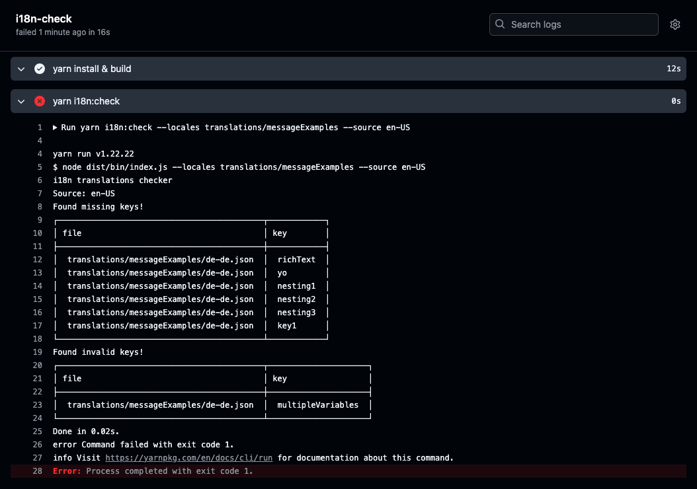

+++
title = "How to validate your React i18next application"
description = "How to ensure your React i18next application is valid and up to date by using i18n-check"
date = 2024-12-16
tags = ["i18n", "i18next", "react", "react-i18next"]
summary = "Ensure that your React i18next application has valid and up to date translations by using i18n-check. In this post we will go through how to setup and run the checks to ensure that no broken, missing or unused keys exit in your localization files."
+++

## Introduction

The popular internationalization library [i18next](https://www.i18next.com/) is often used in **React** applications via [react-i18next](https://react.i18next.com/).
`i18next` offers the most common internationalization functionalities needed to enable multiple languages in a modern JavaScript based application.
With `react-i18next` the core features are enhanced through React **components** and **hooks** and other React specific functionalities to simplify the integration.

Once the i18n capabilities and the translation files are setup, it's also good practice to check for the validity of these files.
For example we want to ensure that our target translations are **valid** and also **up to date**. This can become a complex tasks once the application reaches a sufficient size,
where we might be dealing with hundred or thousands or translation keys and multiple languages.
It's easy to lose the overview of the current status.

Mainly we want to ensure that our translation files contain no **outdated or broken keys or translations**, additionally we also want to **avoid keeping unused keys around**.
Especially broken translations might break a component or degrade the user experience in another way. We want to avoid our application from feeling broken.
So checking for the validity of these translations should happen before they reach production, as to avoid finding out at **runtime**.

It's only sensible to **automate i18n checks** and run these checks at specific points time, i.e. on the **CI** or as **pre-commit** hook.

In this post we will look into how we can use [i18n-check](https://github.com/lingualdev/i18n-check) to find **unused**, **untranslated** or **invalid translation messages** when working with React and i18next.

## Checking for missing, invalid and unused keys

`i18next` offers multiple ways to [extract translations from the codebase](https://www.i18next.com/how-to/extracting-translations), and then create valid localization files based on these extracted translations keys.
One of the [recommended parsers](https://www.i18next.com/how-to/extracting-translations#id-2-using-an-extraction-tool) for extracting keys is [i18next-parser](https://github.com/i18next/i18next-parser).

`i18next-parser` can be run from the CLI to extract the messages and create up-to-date base languages file.
Any change in the base language requires all other languages to be updated as well.

The following examples are taken from the [Validating your react-intl applications](https://lingual.dev/blog/validating-react-intl-applications/) post.

We are looking for a simple way to answer the following questions:

> How many keys are missing in the `de` language file?

or

> Are all keys valid in the `it` file?

> Missing keys are clear enough to understand, as they either exist in the target language files or not. When it comes to **invalid/broken keys** the situation can be more complex. Potential situations where the key could be in an invalid state can occur when dealing with time or date formats, translations including currency, pluralisation or translations containing tags.

_[Introducing i18n-check](https://lingual.dev/blog/introducing-i18n-check/)_

To get a better understanding, check the following translations:

```json
// en.json
"message.greeting": "Hi, <b>{name}</b>!"

// de.json
"message.greeting": "Hallo {name}!"
```

The default message in the `en.json` file contains tags, while the target language file `de.json` is missing the tags around the `name` placeholder.

```json
// en.json
"message.greeting": "Hi {user}, it is {today, date, medium}.",

// de.json
"message.greeting": "Hallo {user}, heute ist {today, date, medium} und morgen ist {tomorrow, date, medium}.",
```

You will notice that the target translation `de.json` file contains two dates as compared to the source `en.json` file only containing one. This example shows how the source and target translations can get out of sync.

It would be very helpful to have automated check that can inform us about the state of our **untranslated, unused and broken translations**.

## Setting up i18n-check

To install `i18n-check` run the following command:

```bash
// yarn
yarn add --dev @lingual/i18n-check

// npm
npm install --save-dev @lingual/i18n-check

// pnpm
pnpm add --save-dev @lingual/i18n-check
```

Once `i18n-check` is installed, you can update the `package.json` file and add a `i18n:check` command - optionally you can give the command a different name:

```json
"scripts": {
    // ...other commands,
    "i18n:check": "i18n-check"
}
```

Once the `i18n:check` command has been added to the package.json file, you can directly access it from the command-line via `yarn i18n:check` or `pnpm i18n:check`.

Alternatively you can access the library directly via:

```bash
node_modules/.bin/i18n-check
```

## Checking your codebase and translation files

For this post we will assume that our translations files exist in a single folder.
A basic setup could include a folder called _messageExamples_ containing a number of translation files organized as `en-en.json`, `fr-fr.json`, `it-it.json` etc:

```
- messageExamples/
  - en-us.json
  - fr-fr.json
  - it-it.json
  - de-de.json
```

For more advanced scenarios you can consult the [README](https://github.com/lingualdev/i18n-check?tab=readme-ov-file#examples), which includes more examples on how to setup the check depending on how the translation files are organised.

You can use the `-l` or `--locales` option to define the directory that contains the target files and with the `-s` or `--source` option you can specify the source language (i.e. `en-us` or `en`) to compare the target files against.

```bash
yarn i18n:check --locales messageExamples --source en-us
```

In the above scenario the `i18n-check` will compare the `fr-fr.json` and `it-it.json` file against the `en-us.json` file and check for any missing or broken keys. Running the above command might return the following result:


```bash
i18n translations checker
Source file(s): messageExamples/en-us.json

Found missing keys!
┌──────────────────────────────┬────────────┐
│ file                         │ key        │
├──────────────────────────────┼────────────┤
│  messageExamples/de-de.json  │  richText  │
│  messageExamples/de-de.json  │  yo        │
│  messageExamples/de-de.json  │  nesting1  │
│  messageExamples/de-de.json  │  nesting2  │
│  messageExamples/de-de.json  │  nesting3  │
│  messageExamples/de-de.json  │  key1      │
└──────────────────────────────┴────────────┘


Found invalid keys!
┌──────────────────────────────┬─────────────────────┐
│ file                         │ key                 │
├──────────────────────────────┼─────────────────────┤
│  messageExamples/de-de.json  │  multipleVariables  │
└──────────────────────────────┴─────────────────────┘


Done in 0.02s.
```

You can also use the `-r` or `--reporter` option to see a summary of the check instead of single keys, this is especially useful if you do not want to list all the keys:


```bash
i18n translations checker
Source file(s): messageExamples/en-us.json

Found missing keys!
┌──────────────────────────────┬───────┐
│ file                         │ total │
├──────────────────────────────┼───────┤
│  messageExamples/de-de.json  │ 6     │
└──────────────────────────────┴───────┘


Found invalid keys!
┌──────────────────────────────┬───────┐
│ file                         │ total │
├──────────────────────────────┼───────┤
│  messageExamples/de-de.json  │ 1     │
└──────────────────────────────┴───────┘


Done in 0.02s.
```

If we want to also check for unused keys, we can extend the command:

```bash
yarn i18n:check --locales messageExamples --source en-us -u client/ -f i18next
```

We need to provide the src entry path via the [`--unused`](https://github.com/lingualdev/i18n-check?tab=readme-ov-file#--format--f) or `-u` option, i.e. `src/`, additionally we also want to tell the check what the [`--format`](https://github.com/lingualdev/i18n-check?tab=readme-ov-file#--format--f) is via `-f i18next`.

There are more [options](https://github.com/lingualdev/i18n-check?tab=readme-ov-file#options) available to configure the check even further. In most cases the aforementioned options should be enough when working with `i18next`.

## Running check on the CI

One way to ensure that our checks always run, based on specific actions, is by running them on the CI. The following is an example for a Github workflow we can use to trigger checks:

```yml
name: i18n-check
on:
  pull_request:
    branches:
      - main
  push:
    branches:
      - main

jobs:
  i18n-check:
    runs-on: ubuntu-latest

    steps:
      - uses: actions/checkout@master

      - name: yarn install & build
        run: |
          yarn install
          yarn build

      - name: yarn i18n-check
        run: |
          yarn i18n-check --locales translations/messageExamples -s en-US -u client/ -f i18next
```

The action will output information based on the checks and can show any broken, unused or missing keys:



Consult the [README](https://github.com/lingualdev/i18n-check?tab=readme-ov-file#as-github-action) for more information on how to setup the CI action.

## Summary

Translations files are hard to keep in sync, as they are mostly in constant change. Automating the validation of `react-i18next` translations files can help to idenify **unused**, **untranslated** or **invalid translation messages**

Checkout i18n-check [here](https://github.com/lingualdev/i18n-check) to run automated checks against your translation files.

If you have further questions in regards to setting up i18n-check or more general questions in regards to running i18n validations on the CLI or CI or just general feedback on this post, you can find Lingual on [Bluesky](https://bsky.app/profile/lingualdev.bsky.social) or [Twitter](https://twitter.com/lingualdev).

## Links

- [i18n-check](https://github.com/lingualdev/i18n-check)
- [i18next](https://www.i18next.com/)
- [react-i18next](https://react.i18next.com/)
- [Introducing i18n-check](https://lingual.dev/blog/introducing-i18n-check/)
- [i18next-parser](https://github.com/i18next/i18next-parser)
- [Checking your i18n on the CI](https://lingual.dev/blog/checking-your-i18n-on-the-ci/)
- [Twitter](https://twitter.com/lingualdev)
