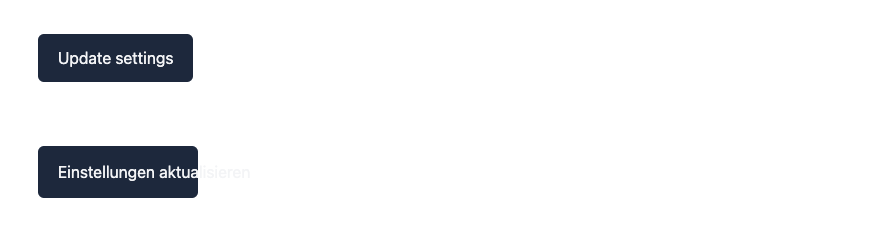
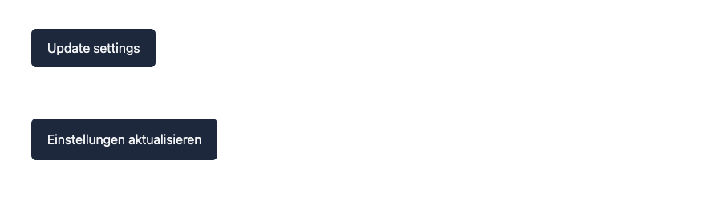
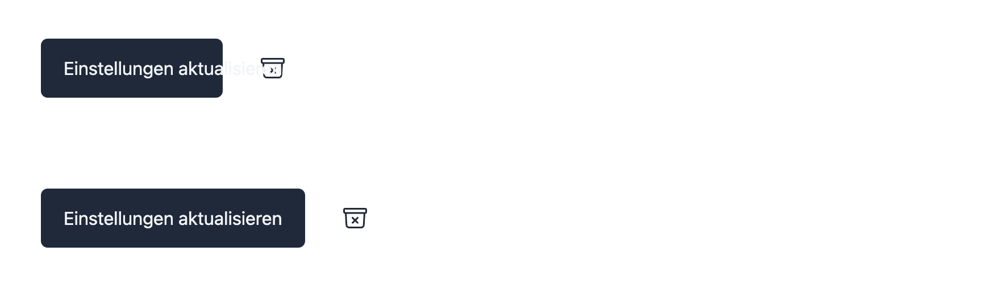

+++
title = "Internationalization checklist for React applications"
date = 2024-09-26
slug = "18n-checklist-for-react-applications"
tags = ["i18n", "React"]
summary = "Localizing your React application requires more than replacing strings, it has to consider date and time, numbers, pluralization, grammar and other requirements. This checklist should help with getting started with your internationalization efforts and avoid pitfalls and blockers."
+++

## Introduction

Before starting any internationalization efforts there are numerous aspects to consider and constraints to understand. This checklist should help to prepare introducing **i18n** into your **React** application. The checklist includes technical as well general internationalization aspects and should be seen as starting point, where you can always get deeper into specific aspects if they apply for your situation.

This checklist has no assumptions to when internationalization is introduced and can be used as a **high level guideline**, no matter if introducing i18n into an existing or a brand new application. Consider that this is **not meant to be a complete checklist** but a basic entry point in to the complex topic of internationalization, which is **more than just simply replacing strings**. With that being said, let's get started.

## Content

- [Using a React i18n library](#using-a-react-i18n-library)
- [Design](#design)
- [Supporting different devices](#supporting-different-devices)
- [Pluralization](#pluralization)
- [Currencies, units, time, date and number formatting](#currencies-units-time-date-and-number-formatting)
- [Conditional text and grammar](#conditional-text-and-grammar)
- [Localization strategy](#localization-strategy)
- [Provide context](#provide-context)
- [Testing and validating your localization](#testing-and-validating-your-localization)
- [Unicode](#unicode)
- [Selecting a translation management system](#selecting-a-translation-management-system)

## Using a React i18n library

While internationalization and localization is often seen as just string replacement, there is a lot more to consider than just how strings are translated.

**I18n also affects currencies, numbers, date, time, pluralization and grammar** and much more, just think about localization (**l10n**), where aspects like color and symbols might need to be adapted to suit a local market.
If you consider the complexity involved with making the above mentioned dynamic, we will want to decouple aspects like date, time, currencies or pluralization from the actual code we write and use a library that knows how to handle these requirements for us.

Just like with most modern languages and frameworks, the React eco-system offers a number i18n specific libraries. With that being said, the two most popular libraries seem to be [`react-i18next`](https://react.i18next.com/) and [`react-intl`](https://formatjs.io/docs/react-intl/), additionally [`lingui`](https://lingui.dev/tutorials/react) can also be mentioned here.


Don't handle internationalization inside your codebase, decouple the two and use an existing i18n library. These already offer existing, supported and tested solutions out of the box.
Let the library handle aspects like date, time, currency, numbers and pluralization.


## Design

**Internationalization also affects your designs.** While the designs will most probably be done with a default language, they might not work when the sentence length changes. A sentence can vary depending on the language selected, so design has to also consider that the **varying sentence length can break a component**.

We want to avoid the above scenario, which also means we need to make our designs adaptable. A good first step is to consider some word in English vs other languages. Some languages use more characters for the same word, like `skating` in English translates to `Schlittschuhlaufen` in German.

To clarify the effects of non responsive components, we can take a look at the following button example:



From the above example we can see that to make the text always fits into the button we need to **make the user elements responsive**.



Independent of the strategy we choose, we need to keep the varying string length in mind when designing the user interface. This will help preventing strings from overlapping each other, that can make your app appear to be broken. Check the following example:

.

The button text overflows and even overlaps another element, preventing that element to be actionable.

For more examples and information on design and i18n check [**Building international User Interfaces**](https://lingual.dev/blog/building-international-user-interfaces/).


The length of a sentence or string can vary depending on the locale. Consider the implication when designing the user interface and ensure that the interface is adaptable to change.


## Supporting different devices

This point also partly correlates with the previous [design](#design) aspect. Different devices will have different screen sizes and these can also affect the **look and feel of our translations**.

Our goal is to achieve consistency across the devices we plan to support, which requires us to consider how varying text lengths and device sizes fit together. The verification process requires to think about **how the user interface could break depending on the width and height of a device**.


Ensure consistency across all the devices that should be supported.
Consider how varying text length and device sizes can affect the look and feel of your application.
Check if word length in a specific locale breaks the layout for a specific device. Make the user interface adaptable to work with different local and devices.


## Pluralization

Pluralization is more than defining a **singular** and **plural** forms. This concept applies for the English language, but does not apply for all languages. [The Unicode Common Locale Data Repository (CLDR) ](https://cldr.unicode.org/index/cldr-spec/plural-rules) distinguishes between six defined forms not two:

1. zero
2. one (singular)
3. two (dual)
4. few (paucal)
5. many
6. other (required—general plural form)

Looking at the above forms, it becomes clear that we **can't simply solve pluralization by hardcoding some if conditions**. The code will become unmanageable and we will introduce bugs. Most i18n libraries already have capabilities to handle the different conditions based on a locale. Letting a library handle the complexity should also help with decoupling our code from the selected locale.


Do not hardcode any if checks to handle pluralization, as there are more than singular or plural forms to consider.
Use an internationalization library to handle pluralization, as these are equipped to handle the complexity.


## Currencies, units, time, date and number formatting

Internationalization is more than simple string translations. We need to consider other aspects when localizing an application. To ensure that our **i18n efforts reflect the selected end user locale**, we need to think about how time, date or numbers are affected.

One goal is to avoid codifying any numbers, dates, time etc. and using a library to do that conversion for us instead. The commonly used React i18n libraries offer functionalities or components to do the heavyweight lifting in the backgroud, so we can decouple the calculations from the codebase.


Use one of the existing React libraries to take care of time, date, numbers, units and currencies!
Do not couple any unit, time, dates, numbers and currencies transformations to the codebase, outsource the work to the library, which is specialized for handling these aspects.


## Conditional text and grammar

The structure of a sentence can not be replicated over different locales. Breaking up a sentence into multiple parts and concatenating will not work in every language. Breaking up the sentence also makes it very hard for a translator to understand and control the sentence.

Check the following example to get a better understanding:

```ts
"Welcome,"  name + "!"
```

In the above example the string is broken up into three parts, but how this work for a different language?

Instead of breaking the sentence up in parts it's better to **use full sentences and work with placeholders**. The translator has a full understanding of the sentence and can change the ordering of the words as needed now, enabling to adapt to specific locale requirements.

The above example can be refactored to a single sentence with a placeholder `name`:

```ts
"Welcome, {name}!";
```

Provide information on the placeholders to help the translator understand the meaning of these placeholders when translating the sentence.


Keep full sentences intact and use placeholder to enable the translator to change the word ordering as required in the target locale.


## Localization strategy

Decide if you want to define your translation messages and keys in the codebase and then extracting them or defining them in the locale/translation files first and then updating the codebase based on these keys.

There is a current trend to also use **TypeScript** for the message id validation, where the compiler will complain if you use a non-existent message id and also leverage autocomplete/intelliSense when filling out the ids. The second approach would makes this flow possible.

On a side-note it might not be that important to use TypeScript for validating message id correctness as there are linters and checkers that can help ensuring the codebase and the locale files are in sync.


Decide if you want to apply i18n in code first or locale files first.
Define if the keys should be extracted from the codebase or if the locale files are updated first and then the keys applied to the codebase.


## Provide context

Once the translation part is decoupled from the codebase, providing context becomes very important. External translator or anyone without access to the code in general will need to understand what the context for the to be translated sentence is

**A sentence can have a different translation depending on the context**. We want to avoid losing the information once the translation is decoupled from the codebase. Context can be provided via using meta information or screenshots. Depending on the message format, there are defined ways to leave meta information associated with a message id.


Add context to the translation keys. Ensure that context specific information is not lost during the developer/translator transition.


## Testing and validating your localization

Before shipping a new locale to production you will want to ensure that your application does not break when working with the new language. There are a couple of possible approaches that can be used to test and validate the localization.

One approach is to randomize the sentences and words to **test different text lengths** and how the layout and user interface adapt to the varying text lengths. This can help to ensure that different word lengths do not break the layout.

A more qualitative approach is to have native speakers **manually test the application** and collect the feedback based on these manual tests. It is a more intensive approach which can't be automated, but can provide valuable and deep insights when rolling out the application to a new region.

Making use of **checkers and linters** is another possible aspect. These can help to **identify missing keys in specific translation files**. Some checkers can also **identify broken translations**. These linters/checkers should be runnable on the CLI and CI and notify when something is broken.
Using checkers and liners is especially helpful for understanding the state of the translations when you are not using any translation management system.

Finally you can also run automated tests against specific languages in your app. These tests can range from UI tests that verify the existence of specific strings to more advanced approaches like visual regression testing.

You can also checkout [i18n-check](https://github.com/lingualdev/i18n-check) if you are using `react-intl` or `react-i18next` to verify your translations.


It's a good idea to research what tools are available for your programming
language and/or framework first and then mix different approaches and see what
yields the best results.


## Unicode

Always use **Unicode (UTF-8)** encoding to ensure that your translations are displayed correctly for any given locale.


Use Unicode (UTF-8) encoding!


## Selecting a translation management system

There might be a need to use a management system to handle the translations. Depending on the situation and complexity of your setup, these tools can range from only updating the translations to handling complex workflows with multiple roles (translators, admins etc.)

## Outro

There are a lot more topics to consider when planning to internationalize your Reaat application like **using machine translations**, **supporting right-to-left languages** or **accessibility** and even how text in images should be handled.
This checklist should be seen as a starting point and if you have any questions or want to leave some feedback, you can find us on [Twitter](https://twitter.com/lingualdev).
