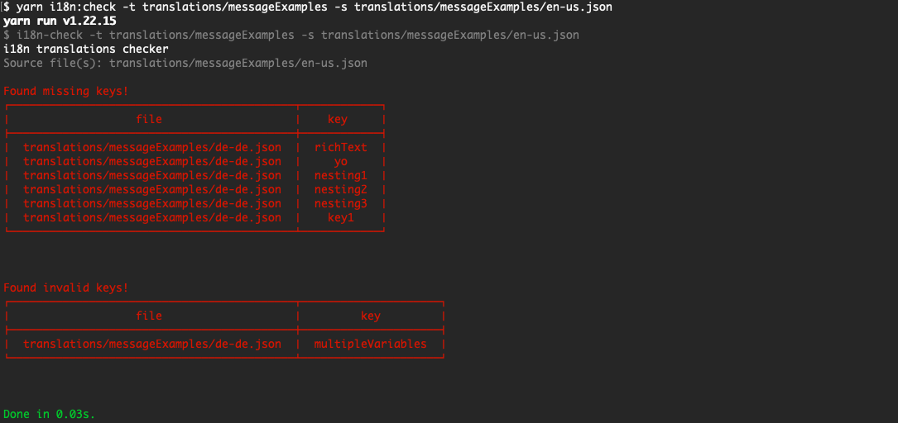
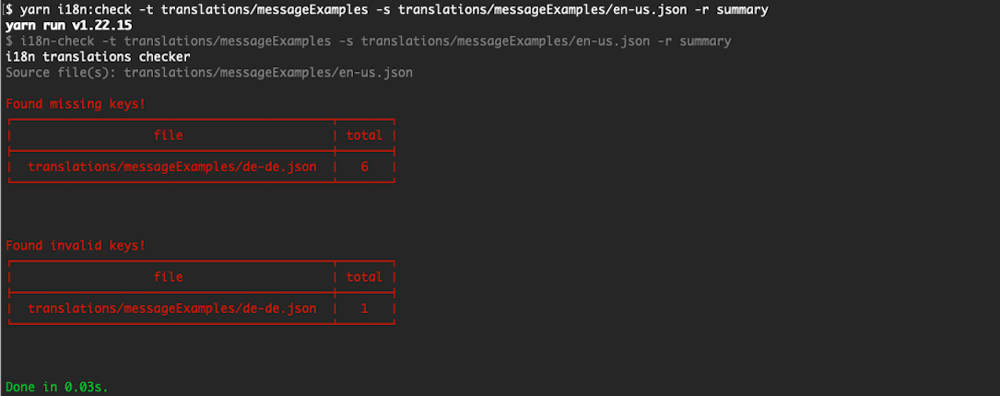

+++
title = "Introducing i18n-check - Improving the i18n developer experience"
description = "Introduction to i18n-check"
date = 2024-06-18
tags = ["i18n"]
summary = "In this post we are introducing i18n-check: a tool that tries to compare your secondary languages to the base language files and report  missing, broken or invalid translation keys."
+++

## Introduction

We released [i18n-check](https://github.com/lingualdev/i18n-check?tab=readme-ov-file#examples) to help with internationalization efforts and support in finding **untranslated** or **invalid translation messages**.

When working with libraries like [react-intl](https://formatjs.io/docs/react-intl/) or [react-i18next](https://react.i18next.com/) you have the option to use extraction tools to keep the default locale JSON file in sync with your codebase. One advantage of choosing an extraction tool is that every i18n related change (creating, updating or removing keys) is reflected in the JSON file. This JSON file is the basis for all other languages. Removing a key in your base language should result in that key being removed in all other languages as well.

Most popular libraries already offer one or more code parsers that can create a valid JSON file based on the current state of the code.
So while the base language can be up-to-date, **the secondary languages might not be**. Additionally if you are not using a third party translation service, you might **lack an overview of the current state of these secondary languages**.

Questions like

> How many keys are missing in the `fr` language file?

or

> Are all keys valid in the `de` file?

require a lot of work to figure out.

Missing keys are clear enough to understand, as they either exist in the target language files or not. When it comes to **invalid/broken keys** the situation can be more complex. Potential situations where the key could be in an invalid state can occur when dealing with time or date formats, translations including currency, pluralisation or translations containing tags.

Take the following translations for example:

```json
// en.json
"message.greeting": "Hi, <b>{name}</b>!"

// de.json
"message.greeting": "Hallo {name}!"
```

The message in the `de.json` file does not contain any tags, while the default language does. They might have been removed during the translation process or were never added in the first place.

```json
// en.json
"message.greeting": "Hi {user}, it is {today, date, medium}.",

// de.json
"message.greeting": "Hallo {user}, heute ist {today, date, medium} und morgen ist {tomorrow, date, medium}.",
```

In the second example the target translation contains more date information as compared to the source `en.json` file, which could mean that the source and target translations might be out of sync.

The check should inform of potential issues in this case.

As developers we don't want to actively think about the state of these translations and rather be informed when something is missing or needs updating.
This is what i18n-check should help with, having **a tool that tries to compare your secondary languages to the base language files** and inform about missing or broken/invalid translation keys.

## Setting up i18n-check

To set up i18n-check run the following command:

```bash
yarn add --dev @lingual/i18n-check
```

Alternatively if you are using npm:

```bash
npm install --save-dev @lingual/i18n-check
```

Or if you are using pnpm:

```bash
pnpm add --save-dev @lingual/i18n-check
```

i18n-check can either be accessed via defining a command in the `package.json` file or directly in the CLI after running the installation command.

Now update the `package.json` file and add a new command:

```json
"scripts": {
    // ...other commands,
    "i18n:check": "i18n-check"
}
```

Run the `i18n:check` command directly from the command-line, i.e. `yarn i18n:check`.

Alternatively you can also access the library directly:

```bash
node_modules/.bin/i18n-check
```

## Checking against your files

Once you have everything set up, you can run `check` commands against single files, single folders or a combination of files and folders. There are a number of possible check scenarios and these depend on how the localization files are structured in your codebase.

To keep this post short, let's take a look at two possible scenarios (there are more advanced scenarios in the [README](https://github.com/lingualdev/i18n-check?tab=readme-ov-file#examples)). A basic setup could include a folder called _locales_ containing a number of translation files organized as `en-en.json`, `fr-fr.json`, `it-it.json` etc:

```
- locales/
  - en-en.json
  - fr-fr.json
  - it-it.json
```

You can use the `-t` or `--target` option to define the directory that contains the target files and with the `-s` or `--source` option you can specify the base/reference file to compare the target files against.

```bash
yarn i18n:check -t locales -s locales/en-en.json
```

In the above scenario the `i18n-check` will compare the `fr-fr.json` and `it-it.json` file against the `en-en.json` file and check for any missing or broken keys. Running the above command might return the following result:



```bash
i18n translations checker
Source file(s): locales/en-en.json

Found missing keys!

In locales/fr-fr.json:

◯ richText
◯ yo
◯ nesting1
◯ nesting2
◯ nesting3
◯ key1

Found invalid keys!

In locales/it-it.json:

◯ multipleVariables

Done in 0.01s.
```

You can also use the `-r` or `--reporter` option to see a summary of the check instead of single keys, this is especially useful if you do not want to list all the keys:



```bash
i18n translations checker
Source file(s): locales/en-en.json

Found missing keys!

In locales/fr-fr.json:

Found 6 missing keys.

Found invalid keys!

In locales/it-it.json:

Found 1 invalid key.

Done in 0.01s.
```

Your files might also be organized as one folder per locale, similar to this:

```
- locales/
  - en-US/
    - one.json
    - two.json
    - three.json
  - de-DE/
    - one.json
    - two.json
    - three.json
```

For this scenario you can define the `locales` folder as the `target` directory to look for target files in and pass `locales/en-US/` as the `source` option. `i18n-check` will try to collect all the files in the provided base directory and compare each one against the corresponding files in the target locales.

```bash
yarn i18n:check -t locales -s locales/en-US/
```

The above command would then compare the `locales/de-DE/one.json` with the `locales/en-US/one.json` and check for any missing or invalid keys.

If you your localization setup is different to the two shown examples, you can check the [examples section in the README](https://github.com/lingualdev/i18n-check?tab=readme-ov-file#examples) for more advanced scenarios.

There are also a number of further options you can use to configure the check even further. For example you can only check for missing keys or only check for broken/invalid translations via the `--check` option.

There are situations where we want to exclude specific files or folders: this can be done via the `--exclude` option. For a more detailed explanation of the available options consult the [options section in the README](https://github.com/lingualdev/i18n-check?tab=readme-ov-file#options)

## Usage

There are multiple ways to incorporate i18n-check into your existing workflow. You can run the checks manually on the CLI or add it as pre-commit hook. Further more you can also let it run on the CI, the following is an example of how you could define the Github workflow:

```yml
name: i18n-check
on:
  pull_request:
    branches:
      - main
  push:
    branches:
      - main

jobs:
  i18n-check:
    runs-on: ubuntu-latest

    steps:
      - uses: actions/checkout@master

      - name: yarn install & build
        run: |
          yarn install
          yarn build

      - name: yarn i18n-check
        run: |
          yarn i18n-check -t translations/messageExamples -s translations/messageExamples/en-us.json
```

i18n-check also offers an API you can directly use if you want to trigger these checks programmatically or if you want to build your own wrapper around the checks.

## Summary

This is the initial release of i18n-check and we have some more plans, including creating a VS Code plugin, so you can run the checks directly inside your IDE and even get some visual feedback on the state of your translations.

Currently the checks only cover ICU and i18next messages, adding gettext file checks is another todo we are planning to work on.

Aside from the aforementioned, we will try to fix any missing scenarios in regards to real world localization setups. We encourage to give i18n-check a try and see if the checks can help improve your localization efforts, especially if you are not using a third party SaaS solution for the translation part (as these often come with helpful information in regards to the state of your localization efforts).

Checkout i18n-check [here](https://github.com/lingualdev/i18n-check)

## Links

- [i18n-check](https://github.com/lingualdev/i18n-check)
- [Twitter](https://twitter.com/lingualdev)
