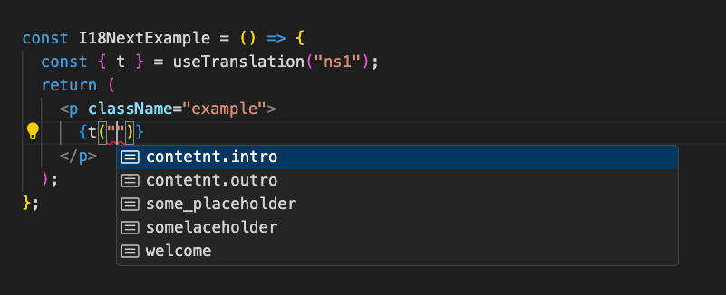
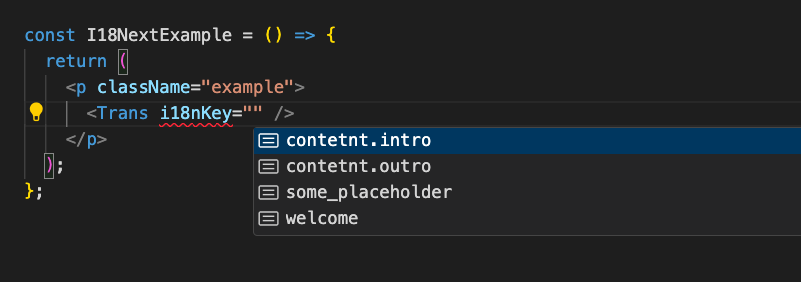
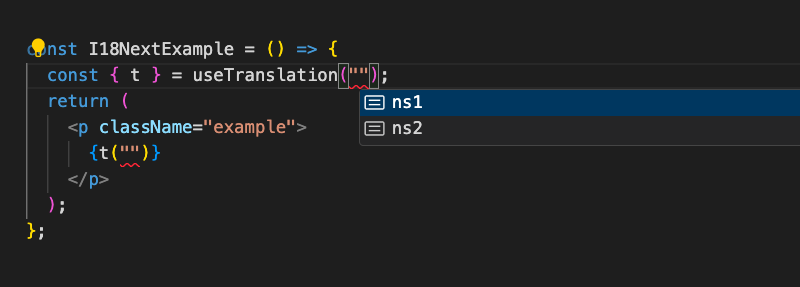
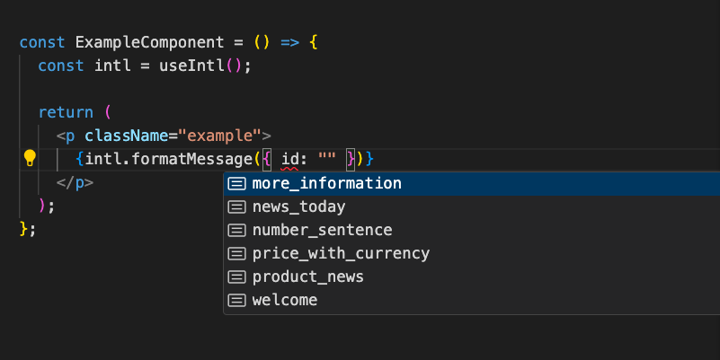
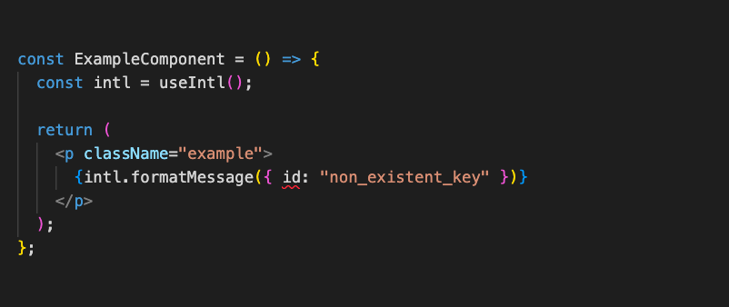

+++
title = "Making your translation keys type-safe in React"
date = 2024-06-27
tags = ["React", "i18n", "TypeScript"]
slug = "making-your-translation-keys-type-safe-in-react-typescript"
summary = "With TypeScript being the de-facto standard way to write React applications it only makes sense to expand the type-safety to our translations, specifically our translation keys. In this post we will explore how useful expanding type-checking to translation keys can be."
+++

## Introduction

With **TypeScript** being the de-facto standard way to write **React** applications it only makes sense to expand the **type-safety** to our translations, specifically our translation keys.

No matter if you are using one of the popular **i18n** libraries like [react-i18next](https://react.i18next.com/) or [react-intl](https://formatjs.io/docs/react-intl/#the-react-intl-package) or other internationalisation packages, you will probably want to explore how useful expanding type-checking to translation keys can be.

While most modern libraries already offer TypeScript support for setting up the library as well as interacting with the API, the translation keys themselves are often typed as a simple `string` type. This approach makes sense, as in most cases you will be adding new keys, not using existing ones. But there are scenarios where leveraging TypeScript to make your keys type-safe is still a benefit.

Depending on your setup there can be situations where catching incorrect or missing keys before they reach production can be achieved by making them type-safe, as opposed to using **validation libraries** or **linters**. Aside from that, a side-effect of type-safety is improved **autocomplete/intellisense capabilities**.

With that being said, one should also consider some limitations and issues that can arise from this approach. It requires to have the **message files up to date**, meaning the keys and translations have to already exist in your locale files, otherwise TypeScript will keep complaining about non-existent keys.

In other words, if you create the **message IDs** and **default translations** in your code via i18n specific components (i.e. `FormatMessage`) or functions (i.e. `formatMessage` or `t`), and then create the locale files via an extraction script based on that code, then the type-safe keys approach is suboptimal. This is where tools like linters or checkers running as a pre-commit hook or on the CI are preferable.

This write-up will go through the setup for two popular libraries in React-land: `react-i18next` and `react-intl`. As a side-note: if you have a specific library that could use TypeScript support, don't hesitate to let us know on [Twitter](https://twitter.com/lingualdev), we might write a follow-up on the topic if there is enough interest.

## Making your translation keys type-safe

The following sections are mainly for existing users of either `react-i18next` or `react-intl` as we will not talk about how to set up these libraries, but only focus on the actual setup to make translation keys type-safe.

## Type-safe translation keys in react-i18next

The first thing we need to do according to the [documentation](https://www.i18next.com/overview/typescript) is to add a `i18next.d.ts` file, as we will need to augment the TypeScript definition:

```ts
import "i18next";

import ns1 from "locales/en/ns1.json";
import ns2 from "locales/en/ns2.json";

declare module "i18next" {
  interface CustomTypeOptions {
    defaultNS: "ns1";
    resources: {
      ns1: typeof ns1;
      ns2: typeof ns2;
    };
    // ...
  }
}
```

Alternatively we can also create an `i18n.ts` file to initialize `i18next` and prepare the resources:

```ts
import i18n from "i18next";
import { initReactI18next } from "react-i18next";

import ns1 from "./locales/en/ns1.json";
import ns2 from "./locales/en/ns2.json";

export const defaultNS = "ns1";

export const resources = {
  ns1,
  ns2,
} as const;

i18n.use(initReactI18next).init({
  debug: true,
  fallbackLng: "en",
  defaultNS,
  resources,
});
```

Now we can directly import `i18n.ts` in our `i18-next.d.ts` file:

```ts
import { defaultNS, resources } from "./i18n";

declare module "i18next" {
  interface CustomTypeOptions {
    defaultNS: typeof defaultNS;
    resources: typeof resources;
  }
}
```

Note that there is a [list of available custom type options](https://www.i18next.com/overview/typescript#custom-type-options) we can override under the `CustomTypeOptions` in the newly created `i18next.d.ts` file.

This change enables us now to use the `t` function in a way, that we can only access keys that already exist in our internationalisation files:



The same goes for the `<Trans>` component, which now checks that the provided `i18nKey` is an existing key and otherwise will error:



Also `useTranslation` will only accept valid namespaces from here on out:



Should you still run into some issues when trying to set up the TypeScript support, the [documentation has a troubleshooting section](https://www.i18next.com/overview/typescript#troubleshooting)

## Type-safe translation keys in react-intl

Adding support for typed message IDs in `react-intl` can be achieved by following the [documentation](https://formatjs.io/docs/react-intl/#typing-message-ids-and-locale).
To change the standard `string` type for message keys to a more restrictive type we need to override the global `FormatjsIntl` namespace.
We can create a file called `react-intl.d.ts` and add the following code:

```ts
import { messages, LOCALES } from "./i18n/messages";

const defaultMessages = messages[LOCALES.ENGLISH];

declare global {
  namespace FormatjsIntl {
    interface Message {
      ids: keyof typeof defaultMessages;
    }
  }
}
```

We are using `defaultMessages` here, as we are interested in the existing keys in the default language. Technically any object containing messages that we can also pass to the `IntlProvider` is valid.

By overriding the `FormatjsIntl` namespace, we can leverage autocomplete/intellisense and error checking inside our codebase. This works for both the `<FormattedMessage>` component as well as the `formatMessage` function, which now only accept an `id` property that also exists in the messages object.

We now have autocomplete for all existing messages:



TypeScript will complain if the message ID does not exist:



## Summary

Adding TypeScript for validating against incorrect or missing keys can be a useful strategy if your message keys are defined outside the React code and then referenced via an `id` property. Not only does this enable capabilities like autocomplete, it also helps to catch non-existent or wrong key names before they land in production.

If your internationalisation workflow is based on creating the keys directly in the code and then extracting them from that code, using linters or checkers might be more useful. TypeScript will complain about invalid keys, but these keys might be extracted or updated in the message files at a different point in time, i.e. as a pre-commit hook.

If you have any questions or want to leave some feedback, you can find us on [Twitter](https://twitter.com/lingualdev).

## Links

[react-intl: typing message IDs and locale](https://formatjs.io/docs/react-intl/#typing-message-ids-and-locale)

[i18next: TypeScript](https://www.i18next.com/overview/typescripts)
