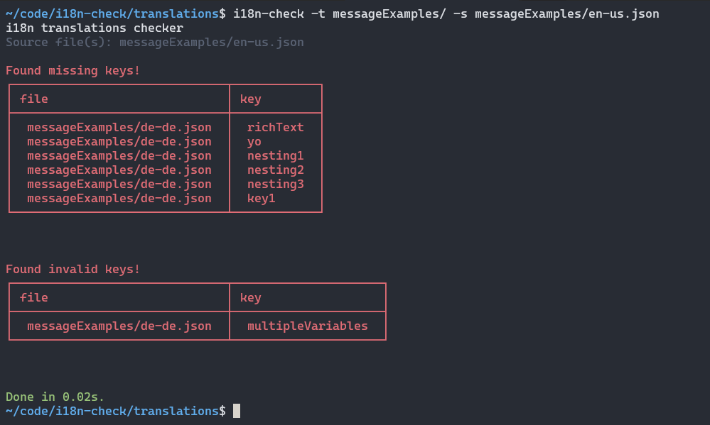
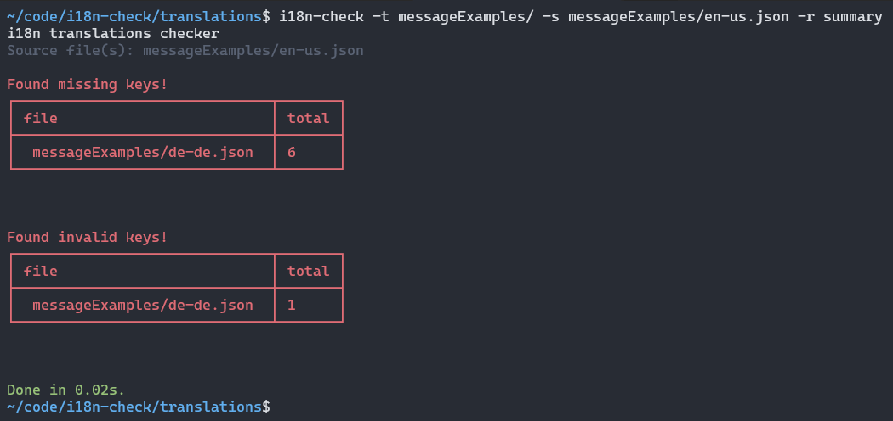
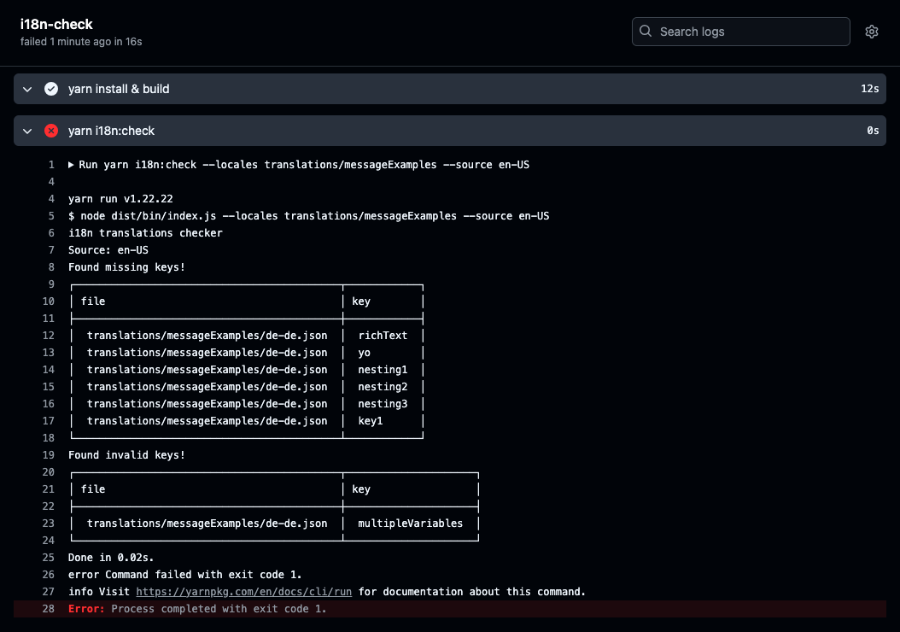

+++
title = "Validating your react-intl applications"
description = "How to ensure your react-intl applications are valid and up to date"
date = 2024-11-03
tags = ["i18n", "react", "react-intl"]
summary = "The blog post explains how to validate react-intl applications and ensure that all keys are in a valid state and no keys are missing or broken for all translations."
+++

## Introduction

When working with [react-intl](https://formatjs.github.io/docs/react-intl) we would like to ensure that our JSON **translations are valid and up to date**.
What we want is to avoid our translation files containing **outdated keys and translations** and **broken target translations**. These broken translations might not be caught until they reach production, causing a suboptimal user experience or broken interfaces at worst.

More often than not, especially if we are not using a translation management system, we don't have a good overview or understanding of the current state of our translations. This is especially true if we are dealing with very large applications containing hundreds or thousands of keys and multiple languages. We want to avoid these type of scenarios.

How can we **automate our checks** as much as possible without having to actively manage the state of our internationalization efforts?

In this post we will see how [i18n-check](https://github.com/lingualdev/i18n-check) can help with our internationalization efforts by finding any **unused**, **untranslated** or **invalid translation messages**.

## What we want to check

By default `react-intl` offers a code parser that can create a valid JSON file based on the translations keys in the code, depending on the setup you could use [@formatjs/cli](https://formatjs.github.io/docs/tooling/cli) to [extract the keys](https://formatjs.github.io/docs/tooling/cli/#extraction).

Using the CLI to extract the messages can ensure that the base language is up-to-date, but **the secondary languages might not be up to date**.

We are looking for a simple way to answer the following questions:

> How many keys are missing in the `fr` language file?

or

> Are all keys valid in the `de` file?

> Missing keys are clear enough to understand, as they either exist in the target language files or not. When it comes to **invalid/broken keys** the situation can be more complex. Potential situations where the key could be in an invalid state can occur when dealing with time or date formats, translations including currency, pluralisation or translations containing tags.

_[Introducing i18n-check](https://lingual.dev/blog/introducing-i18n-check/)_

To get a better understanding, check the following translations:

```json
// en.json
"message.greeting": "Hi, <b>{name}</b>!"

// de.json
"message.greeting": "Hallo {name}!"
```

The default message in the `en.json` file contains tags, while the target language file `de.json` is missing the tags around the `name` placeholder.

```json
// en.json
"message.greeting": "Hi {user}, it is {today, date, medium}.",

// de.json
"message.greeting": "Hallo {user}, heute ist {today, date, medium} und morgen ist {tomorrow, date, medium}.",
```

In the above example the target translation `de.json` contains two dates as compared to the source `en.json` file only containing, which indicates that the source and target translations are out of sync.

What we are looking for is an automated check that can inform us on untranslated, unused and broken translations.

## Getting started with i18n-check

The following command will install `i18n-check`:

```bash
// yarn
yarn add --dev @lingual/i18n-check

// npm
npm install --save-dev @lingual/i18n-check

// pnpm
pnpm add --save-dev @lingual/i18n-check
```

The `i18n-check` command can either be accessed in the `package.json` file or directly in the CLI after running the installation command.

You can update the `package.json` file and add a new command:

```json
"scripts": {
    // ...other commands,
    "i18n:check": "i18n-check"
}
```

Once you have added the `i18n:check` command, you can directly call it from the command-line, i.e. `yarn i18n:check`.

As an alternative approach you can also access the library directly via:

```bash
node_modules/.bin/i18n-check
```

## Checking your codebase and translation files

For this post we will assume that our translations files exist in a single folder. A basic setup could include a folder called _messageExamples_ containing a number of translation files organized as `en-en.json`, `fr-fr.json`, `it-it.json` etc:

```
- messageExamples/
  - en-us.json
  - fr-fr.json
  - it-it.json
  - de-de.json
```

For more advanced scenarios you can consult the [README](https://github.com/lingualdev/i18n-check?tab=readme-ov-file#examples), which includes more examples on how to setup the check depending on how the translation files are organised.

You can use the `-l` or `--locales` option to define the directory that contains the target files and with the `-s` or `--source` option you can specify the source language (i.e. `en-us` or `en`) to compare the target files against.

```bash
yarn i18n:check --locales messageExamples --source en-us
```

In the above scenario the `i18n-check` will compare the `fr-fr.json` and `it-it.json` file against the `en-us.json` file and check for any missing or broken keys. Running the above command might return the following result:



```bash
i18n translations checker
Source file(s): messageExamples/en-us.json

Found missing keys!
┌──────────────────────────────┬────────────┐
│ file                         │ key        │
├──────────────────────────────┼────────────┤
│  messageExamples/de-de.json  │  richText  │
│  messageExamples/de-de.json  │  yo        │
│  messageExamples/de-de.json  │  nesting1  │
│  messageExamples/de-de.json  │  nesting2  │
│  messageExamples/de-de.json  │  nesting3  │
│  messageExamples/de-de.json  │  key1      │
└──────────────────────────────┴────────────┘


Found invalid keys!
┌──────────────────────────────┬─────────────────────┐
│ file                         │ key                 │
├──────────────────────────────┼─────────────────────┤
│  messageExamples/de-de.json  │  multipleVariables  │
└──────────────────────────────┴─────────────────────┘


Done in 0.02s.
```

You can also use the `-r` or `--reporter` option to see a summary of the check instead of single keys, this is especially useful if you do not want to list all the keys:



```bash
i18n translations checker
Source file(s): messageExamples/en-us.json

Found missing keys!
┌──────────────────────────────┬───────┐
│ file                         │ total │
├──────────────────────────────┼───────┤
│  messageExamples/de-de.json  │ 6     │
└──────────────────────────────┴───────┘


Found invalid keys!
┌──────────────────────────────┬───────┐
│ file                         │ total │
├──────────────────────────────┼───────┤
│  messageExamples/de-de.json  │ 1     │
└──────────────────────────────┴───────┘


Done in 0.02s.
```

If we want to also check for unused keys, we can extend the command:

```bash
yarn i18n:check --locales messageExamples --source en-us -u client/ -f react-intl
```

We need to provide the src entry path via the [`--unused`](https://github.com/lingualdev/i18n-check?tab=readme-ov-file#--format--f) or `-u` option, i.e. `src/`, additionally we also want to tell the check what the [`--format`](https://github.com/lingualdev/i18n-check?tab=readme-ov-file#--format--f) is via `-f react-intl`.

There are more [options](https://github.com/lingualdev/i18n-check?tab=readme-ov-file#options) available to configure the check even further. In most cases the aforementioned options should be enough when working with `react-intl`.

## Automate the checks

We can automate the checks by running them on the CI. This is an example of how a Github workflow can be defined:

```yml
name: i18n-check
on:
  pull_request:
    branches:
      - main
  push:
    branches:
      - main

jobs:
  i18n-check:
    runs-on: ubuntu-latest

    steps:
      - uses: actions/checkout@master

      - name: yarn install & build
        run: |
          yarn install
          yarn build

      - name: yarn i18n-check
        run: |
          yarn i18n-check --locales translations/messageExamples -s en-US -u client/ -f react-intl
```

This is the output that would be shown when running the action: 

For more information on how to setup a CI action check the [README](https://github.com/lingualdev/i18n-check?tab=readme-ov-file#as-github-action).

## Summary

Translations files are hard to keep in sync, as they are mostly in constant change. Automating the validation of `react-intl` translations files can help to idenify **unused**, **untranslated** or **invalid translation messages**

Checkout i18n-check [here](https://github.com/lingualdev/i18n-check)

If you have further questions in regards to setting up i18n-check or more general questions in regards to running i18n validations on the CLI or CI or just general feedback on this post, you can find Lingual on [Twitter](https://twitter.com/lingualdev).

## Links

- [Introducing i18n-check](https://lingual.dev/blog/introducing-i18n-check/)
- [Checking your i18n on the CI](https://lingual.dev/blog/checking-your-i18n-on-the-ci/)
- [i18n-check](https://github.com/lingualdev/i18n-check)
- [Twitter](https://twitter.com/lingualdev)
